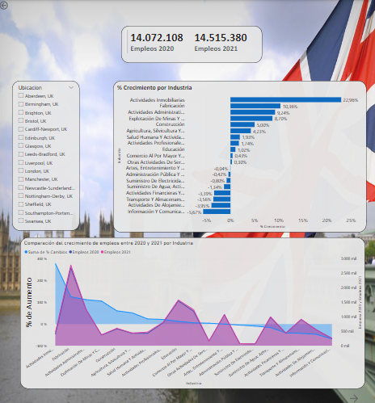
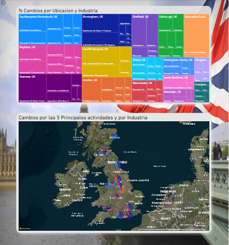
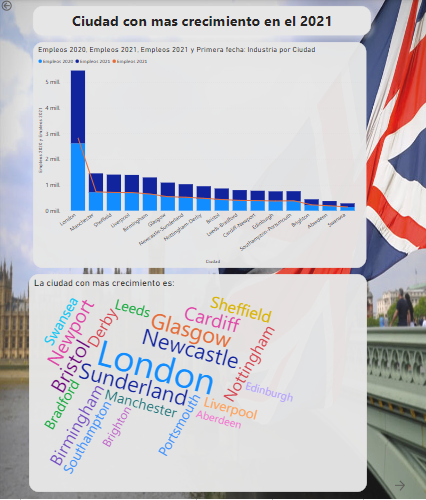
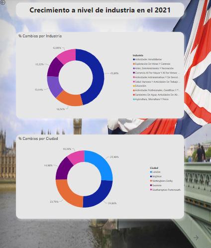

# Mi primer informe en GitHub

## Explicacion

Este proyecto explica brevemente los empleos con más crecimiento en el Reino Unido entre 2020 y 2021 (Realizado para el Bootcamp de analisis y visualizacion de datos con CDI CHILE año 2022 por Eva Alvarez y yariana Mora)

