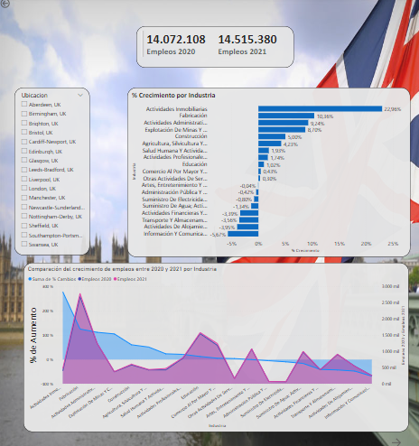
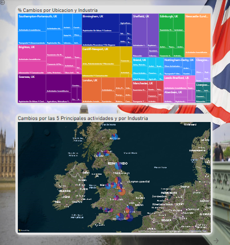
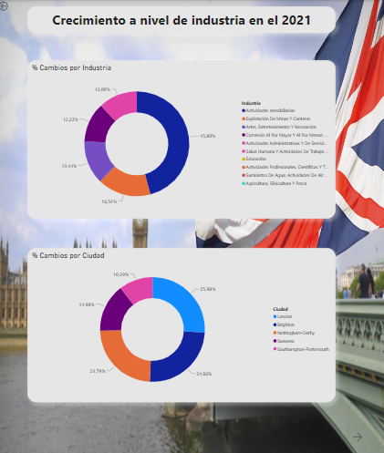

# Portafolio Eva Alvarez en Power BI

Esto es el proyecto final realizado en el bootcamp de tecnicas de analisis y visualizacion de datos con CDI CHILE

## Explicacion del análisis

Análisis de la evolución del empleo entre los años 2020 y 2021 en Reino Unido (Data tomada de google)

